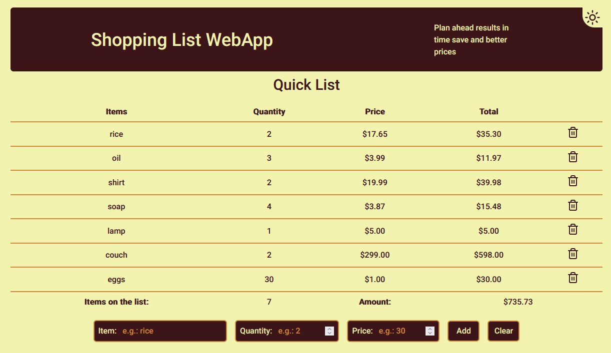
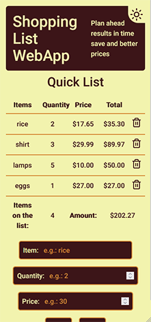

<h1 align="center">
    Shopping-list WebApp
</h1>

<p align="center">
  

  

  
  <a href="https://github.com/codi-andre/shopping-list/commits/master">
    
  </a>

  <a href="https://github.com/codi-andre/shopping-list/issues">
    
  </a>
</p>

<p align="center">
  <a href="#technologies">Technologies</a>&nbsp;&nbsp;&nbsp;|&nbsp;&nbsp;&nbsp;
  <a href="#how-to-use">How To Use</a>&nbsp;&nbsp;&nbsp;
</p>

<h2 align="center">App screenshot</h2>

<p align="center">
  
  
</p>

## Technologies

This project is under development with the following technologies:

- [ReactJS](https://reactjs.org/)
- [NextJS](https://nextjs.org/)
- [TailwindCSS](https://tailwindcss.com/)
- [Radix-UI](https://www.radix-ui.com/)
- [Lucide](https://lucide.dev/)
- [NanoId](https://github.com/ai/nanoid)

## How To Use

First, run the development server:

```bash
npm run dev
# or
yarn dev
# or
pnpm dev
```

Open [http://localhost:3000](http://localhost:3000) with your browser to see the result.

Check out my [LinkedIn profile](https://www.linkedin.com/in/aegis-andre) - your feedback is welcome! if you like what i'm doing, let's work together.
